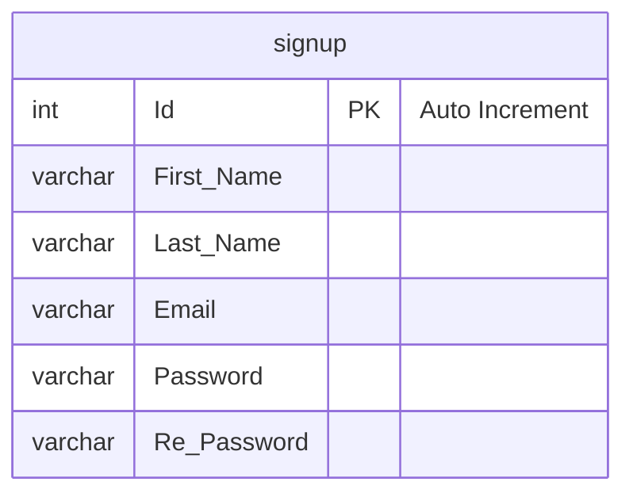
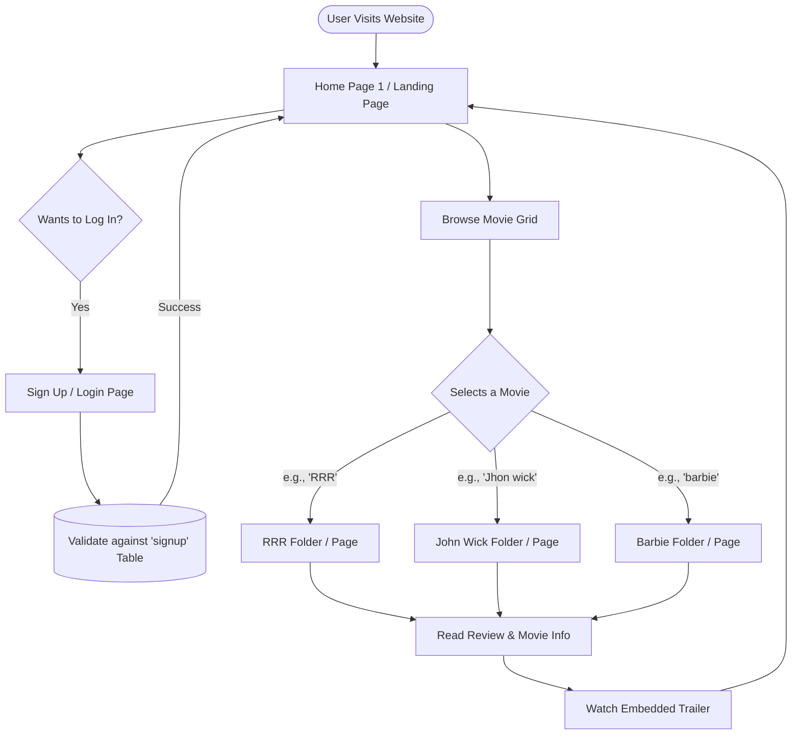
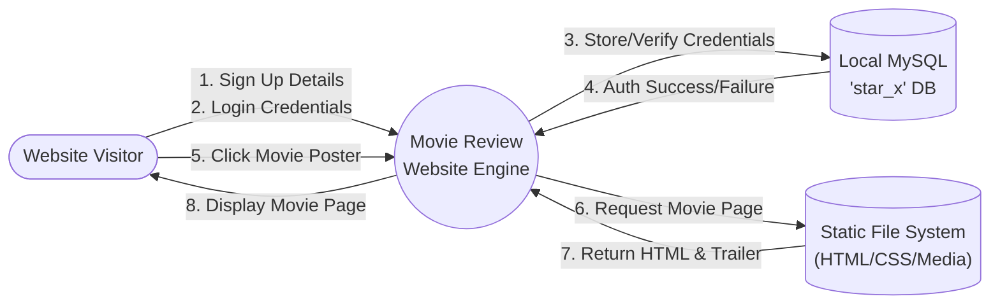

# System Design Report: Movie Review Website

To help you properly design and visualize the architecture of the **Movie Review Website** project, I have generated three core diagrams: an **Entity Relationship Diagram (ERD)**, a **User Flow**, and a **Data Flow Diagram (DFD)**. These are based on the SQL schema (`star_x.sql`) and the static folder structure of your application.

---

## 1. Entity Relationship Diagram (ERD)

Because this is a static-heavy college mini-project, the database schema is extremely simple. The `star_x.sql` file only contains a single table used for user authentication. The movie reviews themselves are not stored in the database but are instead hardcoded into the individual movie HTML/PHP files.

---

## 2. User Flow Diagram

This flowchart represents the journey a user takes through your movie review website, from arriving on the landing page, authenticating via the signup table, and browsing individual movie folders (like RRR, John Wick, Barbie).

---

## 3. Data Flow Diagram (DFD - Context Level)

The DFD shows how data moves between the User, your local MySQL database, and the static file system. Notice that the movies are served directly from the file system, not the database.

> [!TIP]
> If you plan to upgrade this project in the future, you should consider moving the "Static Movie Data" into the MySQL database so you don't have to create a new folder every time you add a movie!

## Summary of Design Objects
1. **The Database (ERD)**: Consists solely of a `signup` table to handle basic user registration and login.
2. **The Routing (User Flow)**: Routing is purely folder-based. Clicking a movie redirects the user to `/[movie_name]/index.html` (or `.php`).
3. **The Data Boundaries (DFD)**: The system acts as a hybrid. It uses dynamic PHP/MySQL for user authentication but relies on a static file architecture for the actual movie content.
